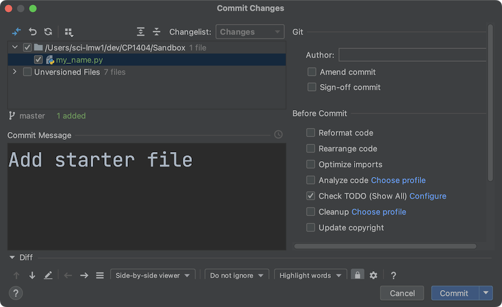

# Practical 02 - Functions, Git Version Control

This week (and from now on), we'll be using Git and GitHub for our work.

If you haven't set up your own GitHub account, please do so now.  
See our instructions at:
<https://github.com/CP1404/Starter/wiki/Software-Setup#github>

Use a meaningful username that identifies you.  
JCU staff should be able to determine who you are from your username.  
Your GitHub account is an important and professional record of
your work. You will likely use it as an online portfolio in the future.

# First!


In one of our end-of-subject YourJCU
student feedback surveys, a student suggested that we do more
hand-writing code to help prepare for the final examination. Great idea!  
And it shows it's a great idea for you to provide us with your feedback --
during the semester anytime, and especially in our main surveys.

**On paper**, write a program that asks the user for a password, with
error-checking to repeat if the password doesn't meet a minimum length set by a variable.  
The program should then print asterisks as long as the word.  
Example: if the user enters `Pythonista` (10 characters), the program should print `**********`.

It's a valuable skill to be able to write code with pen and paper --
without the support of an IDE. Watch out for things like consistent
variable names and clear indenting as well as basic syntax like colons
and brackets.

# Walkthrough Example


Let's start with the basics of **Git** version control.  
***Git and GitHub are different things!***  
These instructions are from the point of view of someone working on a JCU lab computer.  
Please keep learning and practising with Git and GitHub.

**Note**: It's not easy to provide exact instructions that cover multiple versions
of PyCharm. Your experience may be a bit different depending
on your OS, version of PyCharm and any settings.

First, we are going to create a new project just to test using Git and GitHub.  
This will not be inside your existing practicals or other projects.  
Keep it separate.

1. **Create a new PyCharm project** (not just a new folder)
   called **Sandbox**, which you can use for doing small tests and
   demos. **DO NOT put it inside your practicals project or any other project.**
2. Add a Python file called `my_name.py` and enter just a single
   docstring (triple-quoted comment) with your own name in it.
3. Now we'll put this project into Git version control (without using
   GitHub).  
   From the PyCharm menu choose **VCS > Create Git Repository...**  
   Accept the default (current) directory it offers.  
   What happened? Not much it seems, but we're ready to **commit**
   our files to Git version control. (You may have noticed some colours change.)
4. Click on the **Git** tool window in the footer and click the **Log** tab.  
   It's empty because our project has no commits.
5. Choose **Git > Commit...**
   You should see a window with a list of changed files with empty tick boxes beside them.  
   We do not want to version control anything in the `.idea` folder, like
   `misc.xml` or `vcs.xml`... but we will add our own code files.
   Tick the box next to `my_name.py`.   
   Now we need to enter a **meaningful commit message** that briefly
   describes what your change will be **using the imperative mood** for your messages.
   One way to think about this is that your message goes after "If applied, this commit will...".  
   Let's use "Add starter file".  
     
   Then click **Commit**.  
   You should now see your first commit appear in the Log tab of the
   Git tool window. ***Yay!***

6. Create a new file called `password_stars.py`
   PyCharm will prompt you to "Add File to Git". **Add** it.
   Type the code you wrote on paper earlier. Test it.

7. Commit again. PyCharm will show you only the files that have changed since the last commit.  
   Use a different commit message, perhaps something like "Add password check program").  
   Get used to using different, always appropriate, commit messages. Imperative mood. Start with a Capital. No
   full-stop  
   Have a look and see that it also appears in your log.  
   We have now saved the state of our project at multiple stages by committing to a ***local* Git repository**.  
   We have not used GitHub at all.

8. Now time for **GitHub**!  
   Choose **Git > GitHub > Share Project on GitHub**  
   Enter your GitHub username and password and press Enter.  
   If PyCharm asks for a master password, just **Cancel** this. You never *need*
   to use this master password facility in PyCharm.  
   Enter a brief description of the repo, leave it public (don't tick Private) and **Share** it.  
   

9. If that worked, PyCharm will show a message in the status
   bar at the bottom of the window. You can click on this to view your new repository (repo) in your
   browser on GitHub. Or go to it manually at a URL like (change to your own username):
   <https://github.com/yourusername/Sandbox>  
   Explore your repo, clicking to see the 2 commits and any other details.  
   So now GitHub stores our same Git project from our local computer, including its commit history.

10. OK, now let's go crazy!  
    Close the project in PyCharm, then delete
    the project from your computer. That's right, delete it all!
    This is what you could do if you had finished working on a lab
    computer, and you had committed and pushed all of your changes to
    GitHub.

11. Now, imagine we've moved to another computer on a different day...
    How do we keep working on our project? We **clone** it. Choose
    **Git > Clone...** from the menu.  
    Please do not use the GitHub website to clone or upload. Always use PyCharm or git command line.  
    Copy and paste the GitHub URL of your Sandbox project, and choose the
    location on your local computer where your projects are stored,
    then click **Clone**. You now have the
    whole project, including any previous version history, locally.

12. Now add another file, `list_files.py`, **Add**, then enter this code:

    ```python
    import os
      
    print(f"The files and folders in {os.getcwd()} are:")
    items = os.listdir('.')
    for item in items:
        prefix = "(d) " if os.path.isdir(item) else "(f) "
        print(f"{prefix}\t{item}")

    ```

13. Run the code. It should show you a list of all the
    files and folders/directories in the current project folder, and you should
    see a directory called `.git`. This is where Git stores all the history
    and state information.  
    If you ever want to move a project that's using git, you can either use GitHub to store it and
    then clone it to the new place, or you can just copy the project, making sure
    you include this `.git` folder.

14. Now **Commit** using the PyCharm shortcut... enter a meaningful message...  
    Use the button option to **Commit and Push**, then check that the new file is up on GitHub.

We covered a fair bit in that walkthrough. Hopefully you can see
the process for working on your projects:

- Initialise any new projects (Create Git Repository) at the beginning
- **Add** new files when you create them
- **Commit** every time you make significant changes (small milestone), using good messages in the imperative voice
- **Push** to GitHub so that you have an up-to-date online copy

Then when you want to keep working on the project again on a different
computer:

- **Clone** the repository from GitHub to your local computer, then add, commit, push, etc.

If you're working on your own computer you won't need to clone --
just keep using the same local repo.

Even though it is possible to edit and upload files directly via the GitHub website,
**do not do this!**

We only made the Sandbox repo so that we could practise Git and GitHub.  
You don't need to use it again, but you're welcome to put whatever you
want there... but do not put your practical work in Sandbox or vice versa.

## Now let's get your practicals on GitHub

Before you follow the same process as above, it is ***essential***
that you have a single project for practicals that has the same folder structure as
<https://github.com/CP1404/cp1404practicals>.  
Check to make sure none of your prac folders contain `.idea` folders.  
If they do, you probably made a "Prac 2" project or something, and you can now delete the `.idea` folder.  
Please tidy up your project or make a new one and copy your Python files
into the correct folders.

Now, for your practicals project, we can Add it to both Git and GitHub in one step.  
**VCS > GitHub > Share Project on GitHub**.

### Your repo must be public!

**It is essential that you leave your practicals repo public.**  
**Do NOT make your repository private, or it will not be assessed.**

**For every prac for the rest of the subject**,
when you finish a task, do a commit with a meaningful message.  
Push your prac work to GitHub at least at the end of each prac.

You do not need to commit or push for every little change, just for
decent-sized changes, **small milestones**, or before you start
making major changes.

Do you understand that if you always keep your work up-to-date on GitHub,
you will _never_ have the problem of not having access to your work?  
You will _always_ have your work available on GitHub. Nice!

# Intermediate Exercises - Functions:

Before we start writing code with functions, let's remind ourselves of some principles.

Function names should say what they do.  
Use verb phrases, and complete the sentence, _"This function will..."_  
E.g., this function will `calculate_area`.

Follow the Single Responsibility Principle (SRP, functions should **do one thing**).

E.g., a function that calculates the area of a rectangle should have the
height and width values passed in as **parameters**, rather than asking the
user for them in the function. That way it can be used no matter where
these values come from.  
It should also **return** the result rather than printing it.
That way the result can be used in any way.

**DO NOT** use any global variables.  
You should never use a global variable in this subject.  
(CONSTANTS can and should be global, but never any variables.)

All functions should have docstring comments that say what the function will do.  
Here's the third place we use the **imperative mood** (what a thing will do):

- Commit messages
- Function names
- Comments

**From now on**, when writing programs with functions, create a `main()`
function for the main part of the program. Put the main function at the
*top* and call it at the *bottom*. If you are changing an existing program
that does not already use functions, *first* put it all in a main function;
then add the other functions.

[The structure for all programs](https://github.com/CP1404/Starter/wiki/Programming-Patterns#main-program-structure)
is:

```python
"""Module docstring"""


# imports
# CONSTANTS

def main():
    """Function docstring"""
    # statements...
    do_stuff()


def do_stuff():
    """Function docstring"""
    # statements...  


main()
```

## Refactoring

We are going to change some of our earlier programs using **refactoring**.

If you need help with any of these, first ask a classmate - to get used
to helping each other - then talk to your tutor.

### Password Check with Functions

File: `password_stars.py`

Copy `password_stars.py` that you wrote earlier from Sandbox into
your `prac_02` folder and commit (with a message like "Add password check program").  
Now let's modify this program.

1. Move all the code inside a `main()` function and call `main()` at the
   bottom. Run it to make sure it works.  
   **Note:** if you don't have a main function, the refactoring below will
   use global variables. So, it's an important first step to use `main` before
   adding other functions.

2. **Refactor** the part that gets the password into a separate function...  
   You could do this manually, but let's use PyCharm's refactoring tool:  
   Select the lines that
   get and check the name (it should be 3-4 lines) then right-click
   and choose **Refactor > Extract Method...**  
   Set the name to `get_password` and press OK.  
   PyCharm should create the function and replace the old code with a
   call like `password = get_password()`  
   If it didn't work properly, your starting code may not have been correct.

3. Now refactor the part that prints the asterisks into a function that
   takes 1 parameter: the password. PyCharm will see that password needs
   to be an input parameter and create the function accordingly.  
   This will be a very simple function, but that's fine.

4. Commit with a meaningful message in the imperative voice.  
   This could be something like "Refactor password check program to use functions"

If you have not done so already, please *upgrade* your GitHub account to a free
student account at:
<https://education.github.com/discount_requests/new>  
(You may need to upload a photo of your JCU student ID.)  
This allows you to have private repositories for free, and you can get the GitHub
Education Pack!

Now we'll refactor two programs from prac 1 to use functions (with suitable
verb-phrase function names)...  
Copy both of these from `prac_01` into `prac_02`, **commit**, then update
them. We do the commit first before updating so that we can see clearly what we have
changed in the "diff".  
We copy (instead of move) them because we want each week's prac folder to
contain that week's prac work (don't change prac 1).

### Temperatures

File: `temperatures.py`

Use 2 functions (NOT one!) for converting Celsius to Fahrenheit and vice versa.  
**Important:** Remember SRP - functions should do one thing, so
these should be simple calculation functions.  
Do not get user input or print output in the functions - do those things outside.

### Scores

File: `score.py`

Copy `broken_score.py` from prac 1 and rename it to `score.py`, then commit.

Your `main` function should ask the user for their score and print the result.  
Write a new function that takes in the user's score
as a parameter and returns the result to be printed.  
**Follow SRP**: The *function* should not print it.

Now add a new part to the bottom of your main function that generates a
***random*** score and prints the result.  
You do NOT need to write a different function to determine the result for the random score.  
If you've written your new function properly, you can use it.  
If you've breached SRP, then you'll see that you can't.

# Do-from-scratch Exercises

## Menu

File: `score_menu.py`

In the lecture there was a "do this now" activity similar to this, so you can use what we did there to help with this
program.

Write a complete Python program following the standard structure that uses a main and other functions.  
Use a main menu following the
[standard menu pattern](https://github.com/CP1404/Starter/wiki/Programming-Patterns#menus):

- get a valid score (must be 0-100 inclusive)
- print result (copy or `import` your function from `score.py`)
- print stars (this should print as many stars as the score)
- quit

# Practice & Extension Work

## Practice

### More scores

Create `more_scores.py` and copy in only your function from `score.py` above.
Now write a main program that uses this function:

- Ask the user for a number of scores
- Generate that many random numbers (scores) between 0 and 100 inclusive
- For each of those scores, write the "result" to a file called `results.txt` as below:

Example file output for 4 random scores:

    66 is Passable
    4 is Bad
    92 is Excellent
    51 is Passable

## Extension

### More temperatures

Create a text file called `temps_input.txt` and fill it with at least 15
floats of any values between -200 and +200. Where will you get these numbers from?  
Write a Python script to create the text file, of course!

Now write a program, `convert_temps.py` , that uses the functions you made to convert temperatures.  
Read the values in `temps_input.txt` as Fahrenheit values and write the converted Celsius values to `temps_output.txt`
.  
(Note: you could just change the function call to convert C->F instead of F->C.)

Example, if your file `temps_input.txt` contained:

    26.590980264932597
    -170.578748893293
    126.69174145157581

You should write `temps_output.txt` as:

    -3.005010963926335
    -112.54374938516278
    52.60652302865323

### GPS (Gopher Population Simulator)

A secret population of 1000 gophers lives near the library. Every
year, a random number of gophers is born, between 10% of the current
population, and 20%. (e.g. 15% of the gophers might give birth,
increasing the population by 150). Also, each year a random number
of gophers die, between 5% and 25% (e.g. 8% of the gophers might
die, reducing the population by 80).

Write a program that simulates a population of gophers over a
ten-year period and displays each year's population size.
The output should look something like this (it's random, so yours
won't be the same):

       Welcome to the Gopher Population Simulator!
       Starting population: 1000
       Year 1
       
       145 gophers were born. 228 died.
       Population: 917
       Year 2
       
       124 gophers were born. 152 died.
       Population: 889
       Year 3
       
       138 gophers were born. 180 died.
       Population: 847
       ...

## Learn Git and GitHub

The following guide shows you lots of useful things just using GitHub online:
<https://guides.github.com/activities/hello-world/>

### Git Command Line

Even if you just use the built-in tools in your IDE, you will be able to
understand more of what's happening in Git Version Control if you know
the command line tools. Over time, you should get experience using both.

So let's learn more about how Git works and pick up some command line
skills by doing the excellent interactive online Git tutorial:

[try.github.io](https://try.github.io)

You may also like to do one or more of the GitHub courses on [LinkedIn Learning](https://au.linkedin.com/learning/)

# Deliverables

This section summarises the expectations for marking in this practical.

- Do not zip up your files.
- Please submit each file separately.
- Ensure each file has the correct/exact name, including the extension.
- Ensure your code is not commented-out (only comments should be commented).

Files required:

- Practicals repository on GitHub and up-to-date
- `password_stars.py`
- `temperatures.py`
- `score.py`
- `score_menu.py`
